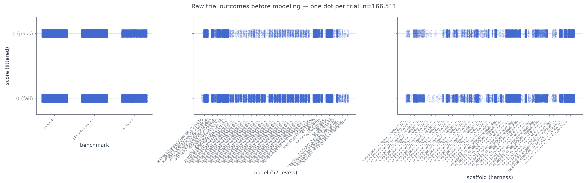
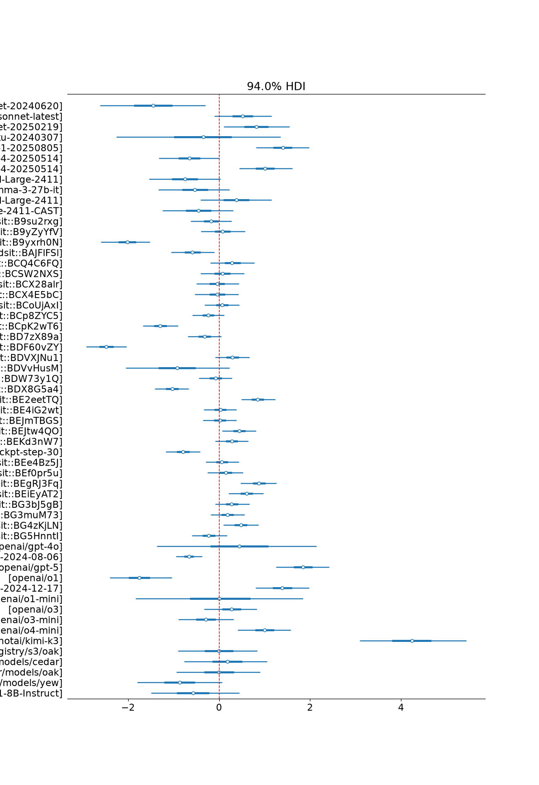
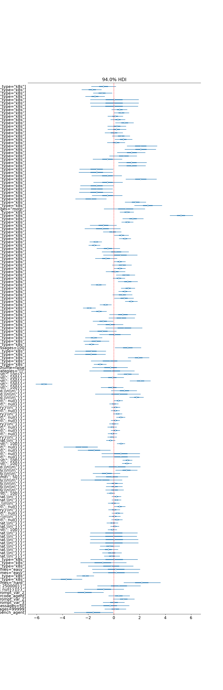
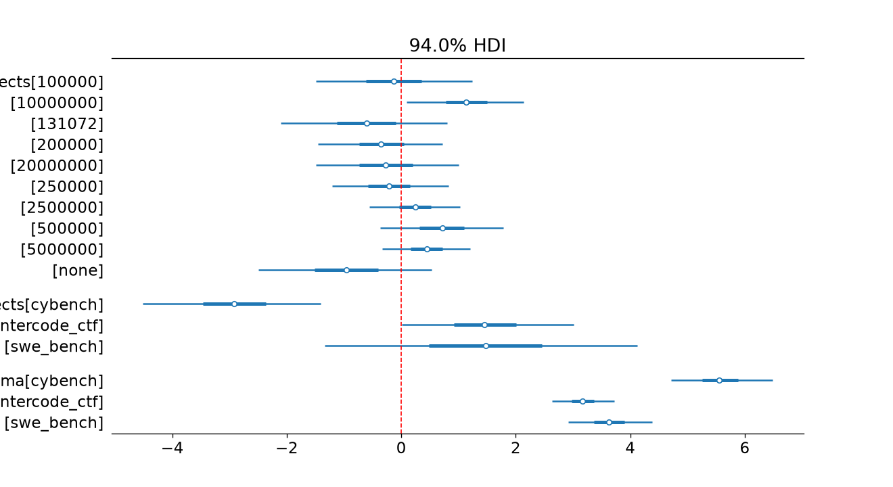
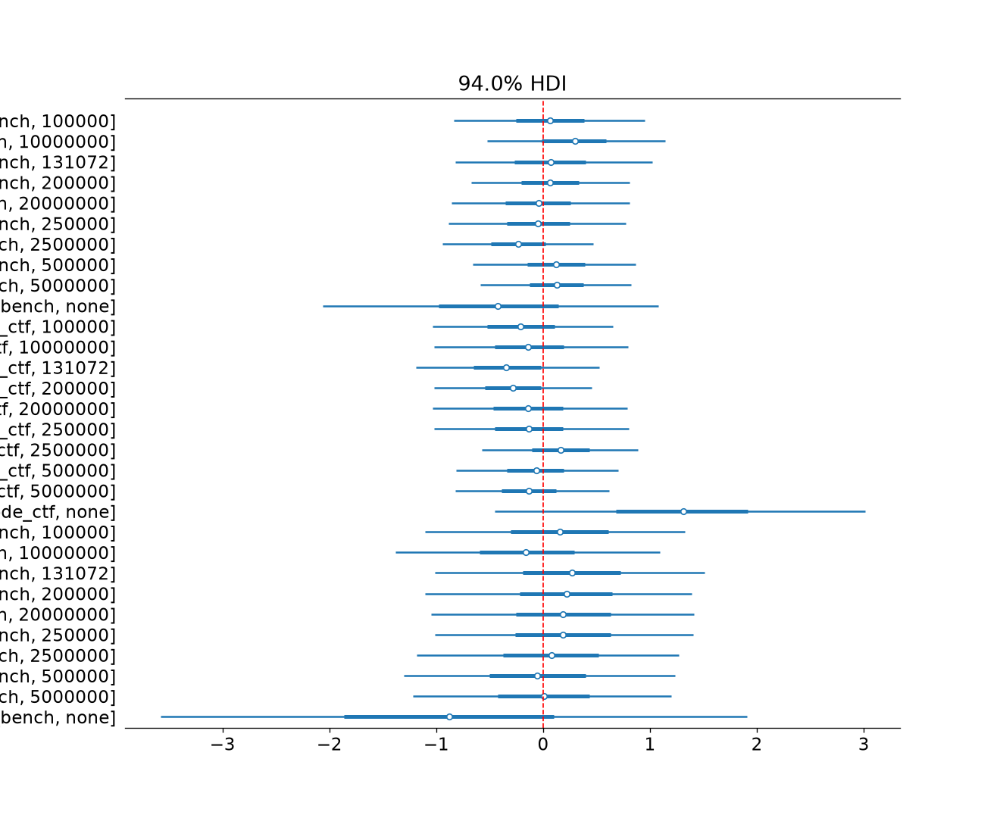

# eva × hibayes: how much does scaffold matter?

One question, one config, one model: **how well do models perform across
benchmarks, and how much of that depends on their scaffold?**

    logit P(pass) = model + scaffold + token_given
                    + benchmark × token_given + benchmark_item
    (item effects nested within benchmark; token_given is the token budget a
    run was granted — "none" when unlimited — with a per-benchmark interaction,
    since a budget can bind differently per benchmark)

Fitted as a hierarchical binomial GLM with [hibayes](https://github.com/UKGovernmentBEIS/hibayes)'
config-driven pipeline, on pass/fail benchmark data from the
[eva](https://github.com/AI-Safety-Institute/eva) warehouse. The whole
analysis is [`modeling/config.yaml`](modeling/config.yaml); everything else is
small custom pieces the config references.

## Layout

```
modeling/
├── config.yaml        the analysis: load → process → model → check → communicate
├── extract.py         eva prod → data/modeling/*.parquet (run on a platform dev VM)
├── processors.py      score coercion, scaffold derivation, item↔benchmark nesting
├── custom_model.py    hierarchical binomial (main effects + nested item effects)
├── discovery/         step 0: which evals are pass/fail, which variables have coverage
└── synth/             parameter-recovery validation of the full pipeline
```

## Run it

Requirements: an AISI platform dev VM (VPC access to the eva Aurora cluster),
AWS credentials, and team_ru membership. `cd ~/dev/eva/client && uv run
eva-check` verifies the setup. eva enforces row-level security: without the
right team role, queries silently return only the rows you can see.

```bash
# 1. discover + extract (the eva-facing step): classifies every task's outcome,
#    reports covariate coverage, then extracts the tasks that are pass/fail AND
#    have a score column configured in config.yaml
uv run python -m modeling.extract

# 2. fit + check + plot, all from the config
uv run hibayes-full --config modeling/config.yaml --out modeling/.output --no-tui

# optional: eyeball the raw trials (one dot per trial, no aggregation) —
# uses the trial-level snapshot the process stage saves before aggregating
uv run python -m modeling.plot_raw
```

Discovery results land in `modeling/discovery/outputs/` (`evals_inventory.csv`,
`variables_coverage.csv`, ...). If discovery surfaces a pass/fail task the
config doesn't map yet, extract reports and skips it — add it to
`coerce_pass_fail_score.score_column_by_benchmark` in the config and re-run.
`--tasks <names>` skips discovery entirely; the discovery scripts also run
standalone.

Outputs land in `modeling/.output/`: convergence and predictive checks under
`models/*/diagnostics/`, the forest plot and summary table under
`communicate/`. Iterate by editing the config (priors, variables, fit
settings) and re-running; the staged CLIs (`hibayes-load` / `hibayes-process`
/ `hibayes-model` / `hibayes-comm`) avoid re-loading data while you iterate on
the model.

## What "scaffold" means here

eva has no scaffold column. We derive one:
`solver | canonical(task_args − data-selection keys) | canonical(solver_args)`
(see `derive_scaffold` in [`modeling/processors.py`](modeling/processors.py)).
Keys that select *items* rather than configure the agent (e.g. cybench
variants) are excluded via config and belong to item identity instead, as are
token/message budgets — those are modeled separately as `token_given`, so
leaving them in the scaffold label would make the two collinear. On real
data, incidental knobs (limits, seeds, tool lists) can fragment the scaffold
factor -- watch the logged cardinality and switch to the `scaffold_keys`
allowlist once discovery shows which keys matter. Reasoning configuration
(`model_generate_config`) is surfaced by discovery but not yet part of the
scaffold or the model. If the scaffold definition changes, only `config.yaml`
changes.

## Validation

The full pipeline — real config, synthetic data — is exercised by:

```bash
uv run python -m modeling.synth.run_synth
```

This generates eva-shaped data with known parameters — including a planted
benchmark × token_given interaction — runs `hibayes-full` on it, and checks
the posteriors recover the truth (gate: ≥85% of the 28 generating parameters
inside their 94% HDI and item-effect correlation ≥ 0.9; the pinned seed
recovers 25/28 — all misses by ≤0.03 — at correlation 0.99). Run it after any
change to the processors, model, or config. Note the synthetic design is fully
crossed and balanced -- it validates the pipeline and the model's
self-consistency, not the confounding that unbalanced real data can introduce
(see below). `uv run pytest` covers the score-coercion and scaffold-label
decision tables.

## Data notes

- `data/` is gitignored: eval results are AISI-internal (the benchmarks are
  public, the results are not) and extracts are ~100s of MB. Regenerate with
  `modeling/extract.py`; `data/modeling/MANIFEST.json` records the snapshot.
- Every fitted number is pinned to its extraction snapshot — the warehouse
  moves, so re-extracting can shift results.
- The five earlier bespoke analyses (epoch design curves, variance
  decomposition, release deltas, growth curves, portfolio health) live in git
  history up to commit `1362644` — including their `FINDINGS.md` — and
  informed this model's priors and its run-effect caveats.

## Results — first real fit (2026-07-21 snapshot, `unified_v1`)

Fit on 166,511 trials across 3 benchmarks (cybench, gdm_intercode_ctf,
swe_bench), 57 models, 160 derived scaffolds, 10 token-budget levels, 274
items. Sampler quality was excellent (r̂ ≈ 1.00 everywhere, min ESS ≈ 3,700,
zero divergences), so the numbers below are what the model believes — the
caveats are about *identification*, not convergence.

**Scaffold matters at least as much as model.** Scaffold effects span
−5.5 to +5.2 logits (63 of 160 exclude zero), wider than the full 57-model
spread of −2.5 (a uk-dsit gpt-4o fine-tune) to +4.2 (kimi-k3). Read the
ranking direction, not individual values: 139/160 scaffolds appear with only
one model, so many "scaffold" effects partially absorb model identity (and
vice versa — kimi-k3's +4.2 rides on thin crossing).

**The confound is visible in plain sight:** `openai/o1` (early bespoke-harness
runs) lands at −1.75 while `o1-2024-12-17` — the same model under later
configs — lands at +1.39. Three logits between two labels for one model is
the model↔scaffold entanglement this analysis exists to separate; it needs
model-name normalisation plus denser crossing to resolve.

**Item difficulty dwarfs everything.** Within-benchmark item spread is
σ ≈ 3.2 (intercode), 3.7 (swe_bench), 5.6 (cybench) — several times the
model spread. Which items a run faces matters more than which model runs it.
Benchmark means: cybench −2.9 logits (much harder than intercode/swe_bench
at +1.5).

**Token budgets: no clean effect.** Only the 10M budget separates from zero
(+1.1 [0.1, 2.1]); point estimates rise with budget, but "none" (no limit
set) sits lowest at −1.0 — evidence that `token_given="none"` is a cohort of
older/different runs, not an experimental "unlimited" arm. No
benchmark × token interaction cell excludes zero.

Iteration queue implied by these results, in order of value: (1) restrict
scaffold to a `scaffold_keys` allowlist to collapse the 160 fragmented
levels; (2) normalise model names (fine-tune checkpoints and provider
prefixes currently count as separate models); (3) add a run-level effect for
overdispersion; (4) drop or re-derive `token_given` unless a budget-varied
cohort exists.

### Figures

Snapshot-pinned copies in [`modeling/figures/`](modeling/figures/) (the full
outputs in `modeling/.output/` are gitignored — the posterior alone is
~250MB). To replicate: re-run the two commands under **Run it**, then
`uv run python -m modeling.plot_raw`; the forest plots are written to
`modeling/.output/communicate/` by the pipeline's communicate stage. A fresh
extract is a new warehouse snapshot, so regenerated numbers can shift.

Raw trials, one dot per attempt, before any model:



Model effects (logit scale, sum-to-zero — 0 is the average model):



Scaffold effects — wider spread than the models, but most levels are
single-model (see caveats above):



Token budgets, benchmark means, and per-benchmark item spread:



Benchmark × token interaction (no cell excludes zero):



## Known limitations (v1)

- **No run effect.** Same-config reruns drift by ~1 logit on some
  provider/benchmark pairs (see E2/E5 in the historical findings), so the
  binomial likelihood is overdispersed and intervals are somewhat optimistic.
  v2 should add a run-level random effect — a config + small model change.
- **model × scaffold × benchmark overlap.** Additive effects are only
  identified where levels are crossed; where a model or scaffold appears on
  only some benchmarks, its effect is confounded with benchmark difficulty and
  the posterior falls back on the prior. Check the crossing table
  (`.output/processed_data.parquet`) before reading the forest plot causally;
  historically some model pairs had zero shared configs.
- **Three benchmarks** on the public team_ru slice. The discovery scripts are
  the path to widening this once broader eva access is in scope.
